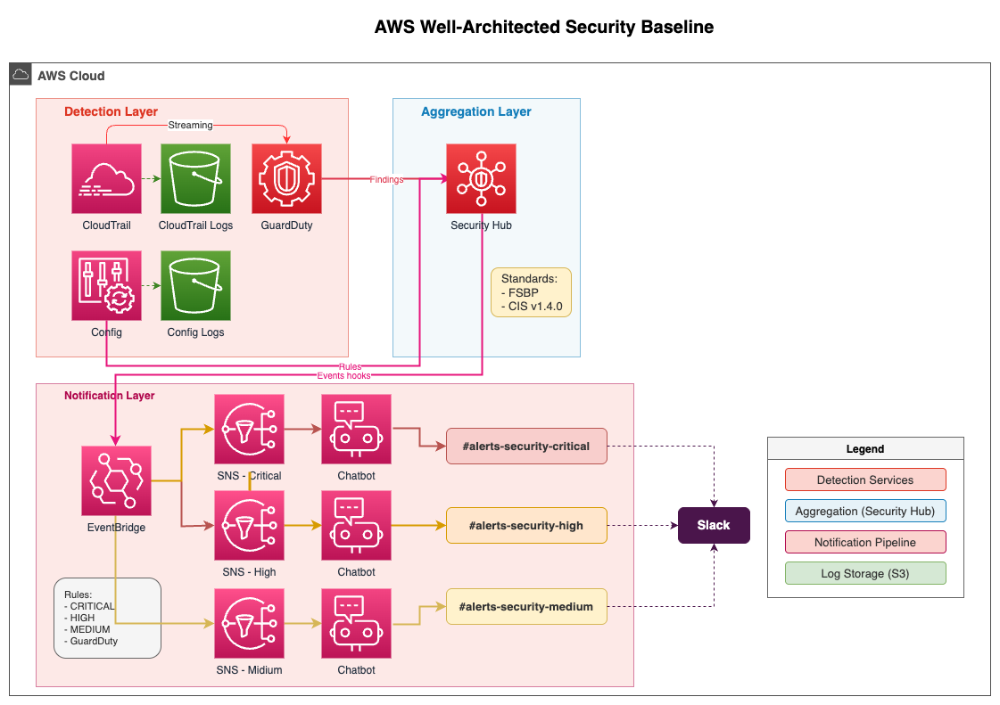

# AWS セキュリティガバナンス基盤

AWS Well-Architected Framework に準拠したセキュリティ基盤を Terraform で構築。

## 概要

AWS 環境の脅威検出・コンプライアンス監視・アラート通知を統合管理する。

### 対象ユーザー

- 情報システム部門
- セキュリティチーム
- コンプライアンス担当者

## アーキテクチャ



### 構成要素

| レイヤー | サービス | 役割 |
|:---------|:---------|:-----|
| **Detection** | GuardDuty | 脅威検出（不正アクセス、マルウェア） |
| | CloudTrail | API 監査ログ |
| | AWS Config | リソース構成記録・Standards 評価 |
| **Aggregation** | Security Hub | セキュリティ統合ダッシュボード |
| | | FSBP + CIS Benchmark v1.4.0 準拠評価 |
| **Notification** | EventBridge | 重要度別イベントルーティング |
| | SNS | 通知配信（CRITICAL/HIGH/MEDIUM） |
| | Chatbot | Slack 連携 |

## Well-Architected 6 柱との対応

| 柱 | このポートフォリオでの実装 |
|:---|:--------------------------|
| セキュリティ | Security Hub, GuardDuty, Config, CloudTrail |
| 運用上の優秀性 | CloudTrail 監査ログ, 自動通知 |
| 信頼性 | - |
| パフォーマンス効率 | - |
| コスト最適化 | - |
| 持続可能性 | - |

## 技術スタック

| サービス | 用途 |
|:---------|:-----|
| **Security Hub** | セキュリティ統合ダッシュボード |
| **GuardDuty** | 脅威検出 |
| **AWS Config** | 構成監査・Standards 評価 |
| **CloudTrail** | API 監査ログ |
| **EventBridge** | イベントルーティング |
| **SNS** | 通知配信 |
| **Chatbot** | Slack 連携 |
| **Terraform** | Infrastructure as Code |

## プロジェクト構成

```
.
├── environments/
│   └── dev/              # 開発環境
├── modules/
│   ├── guardduty/        # GuardDuty 設定
│   ├── cloudtrail/       # CloudTrail + S3
│   ├── config/           # AWS Config Recorder + S3
│   ├── security-hub/     # Security Hub + Standards
│   └── notification/     # EventBridge + SNS + Chatbot
├── docs/
│   ├── demo/             # デモシナリオ
│   └── plans/            # 設計・拡張計画
├── architecture.drawio   # アーキテクチャ図（編集用）
├── architecture.png      # アーキテクチャ図（表示用）
└── README.md
```

## 重要度別通知設定

| 重要度 | Slack チャンネル | 対応目安 |
|:-------|:-----------------|:---------|
| CRITICAL | #alerts-security-critical | 即時対応 |
| HIGH | #alerts-security-high | 当日中 |
| MEDIUM | #alerts-security-medium | 1週間以内 |

## Getting Started

### 前提条件

- AWS CLI 設定済み
- Terraform >= 1.5.0
- Slack ワークスペース（通知用）
- AWS Chatbot と Slack の連携済み

### クイックスタート

```bash
# リポジトリをクローン
git clone https://github.com/kuma8088/aws-well-architected-security-baseline.git
cd aws-well-architected-security-baseline

# 環境設定
cd environments/dev
cp terraform.tfvars.example terraform.tfvars
# terraform.tfvars を編集

# デプロイ
terraform init
terraform plan
terraform apply
```

### デモ実行

デプロイ後、[デモシナリオ](./docs/demo/demo-scenario.md) を参照してください。

## 拡張オプション

将来の拡張案については [拡張オプション計画](./docs/plans/future-expansion-options.md) を参照。

- Cloudflare セキュリティイベント統合
- マルチクラウド監視ダッシュボード

## 関連プロジェクト

- [AWS Observability Incident Response](https://github.com/kuma8088/aws-observability-incident-response) - 運用監視・インシデント対応 (PF14)

## ライセンス

MIT License

## 作成者

Naoya Iimura
